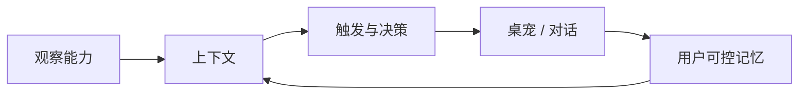

<p align="center">
  
</p>

<h1 align="center">Amadeus · 个人桌面 Agent</h1>

<p align="center">
  本地优先、可主动交互、拥有用户可控记忆的 Windows / macOS 桌面伴侣
  <br>
  <b>Flutter</b> · <b>Live2D</b> · <b>TimeTrace observation</b> · <b>Local memory</b>
</p>

<p align="center"><a href="README_EN.md">English</a></p>

---

## 它是什么

Amadeus 不是 TimeTrace 的皮肤，也不只是一个 Live2D 桌宠。它是独立运行的个人桌面 Agent：桌宠是交互外形，TimeTrace 是可选的观察能力，SQLite 是受用户控制的记忆层。



- **观察能力**：TimeTrace 当前状态与历史聚合；以后可扩展日历、GitHub 或系统状态
- **上下文**：只把本次交互需要的信息组合起来，不把每次观察都当成永久记忆
- **主动性**：整点、久坐、切窗激增、空闲归来、专注与记忆关心等触发器
- **交互外形**：透明窗口、托盘、Live2D、气泡与输入栏
- **记忆**：近期对话、结构化日事实和经审核的长期记忆，均可由用户清除

TimeTrace 不可用时，Amadeus 自动降级为普通对话 Agent。

## 设计原则

### 观察不等于记忆

TimeTrace 只提供短期、只读的观察。记忆层负责筛选哪些偏好、目标或重要事件值得保留，并提供查看和删除入口。

### 形象不等于人格

Live2D 模型与 `soul.md` 分离：更换形象不会偷偷改写人格，修改人格也不会打包或上传模型资源。

### 本地使用不等于可分发

首次导入会要求用户确认拥有本机使用权，并明确说明这不自动包含公开分发或商业使用权。本仓库不捆绑、不下载、不分发任何第三方角色模型或人格设定；发行版默认使用原创 Amadeus 人格。

## 当前能力

- OpenAI / DeepSeek / 自定义 OpenAI 兼容接口
- 流式对话与中断保护
- 可配置主动触发、频率上限、忙时降噪与空闲休眠
- 本地 SQLite 长期记忆与 TimeTrace 日聚合
- Cubism 2.1 (`*.model.json`) 本地模型包导入与依赖校验
- Windows WebView2 与 macOS WKWebView 渲染
- Windows / macOS 托盘、透明窗口、多窗口设置页
- 统一的引导页与桌面工作台式设置界面

## 隐私边界

| 数据 | 默认位置 | 是否发送给 AI 服务 |
| --- | --- | --- |
| Live2D 模型、人格文件、API Key | 本机用户数据目录 | 否 |
| 窗口标题、截图、日记原文、数据库路径 | 本机 | 否 |
| 用户消息、必要的近期对话 | 本机 + 本次请求 | 是 |
| TimeTrace 聚合摘要 | 短期上下文 | 仅启用观察能力且本次相关时 |
| 经审核的长期记忆 | 本地 SQLite | 仅在相关对话召回时 |

Windows 延续旧版目录：`%APPDATA%\timepet`。macOS 使用 `~/Library/Application Support/Amadeus`。

## 运行与配置

首次启动会依次说明：

1. Amadeus 与 TimeTrace 的关系
2. 形象、人格、观察数据和 AI 服务的边界
3. 本地模型包导入与权利确认

API Key 可以在“能力与人格”中配置，也可使用环境变量：

| 变量 | 说明 |
| --- | --- |
| `OPENAI_API_KEY` | OpenAI API Key |
| `DEEPSEEK_API_KEY` | DeepSeek API Key |
| `TIMEPET_API_KEY` | 当前兼容接口的通用 Key |
| `TIMEPET_MODEL` | 覆盖模型名 |
| `TIMEPET_BASE_URL` | 覆盖 OpenAI 兼容 Base URL |
| `TIMEPET_TT_DB` | 覆盖 TimeTrace `time.db` 路径 |
| `TIMEPET_TT_API` | 可选的旧版本地桥地址 |

ChatGPT / Codex 订阅登录不能直接作为第三方桌面应用的 API 凭据。

## 构建

环境要求：Flutter stable。Windows 需要 Visual Studio Desktop C++，macOS 需要当前 Xcode。

```bash
flutter pub get
flutter analyze
flutter test

# Windows
flutter build windows --release

# macOS
flutter build macos --release
```

GitHub Actions 会分别在 Windows 和 macOS runner 上生成构建产物。CI 的 macOS artifact 是未公证的开发产物；公开分发仍需使用 Apple Developer ID 签名并提交 notarization，否则 Gatekeeper 会提示无法验证开发者。

## 目录

| 目录 | 作用 |
| --- | --- |
| `lib/services/observation_source.dart` | Agent 观察能力边界 |
| `lib/services/tt_api.dart` | TimeTrace HTTP / 本地只读 SQLite 适配 |
| `lib/services/pet_memory.dart` | 记忆筛选、召回与画像 |
| `lib/services/trigger_engine.dart` | 主动性与打扰控制 |
| `lib/ui/` | 引导、设置、气泡与输入 |
| `assets/web/` | 跨平台 Live2D Web 渲染层 |
| `windows/` / `macos/` | 桌面平台工程 |

## License

[GPL-3.0](LICENSE)。`assets/web/vendor/live2d-widget` 基于 `stevenjoezhang/live2d-widget`（AGPL-3.0），详见其 LICENSE。

仓库不附带任何第三方 Live2D 模型或受版权保护的角色人格。用户应仅导入自己有权使用的资源，并自行确认公开发布、二次分发与商业使用条件。
