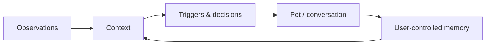

<p align="center">
  
</p>

<h1 align="center">Amadeus · Personal Desktop Agent</h1>

<p align="center">
A local-first Flutter + Rust desktop companion with user-controlled memory for Windows and macOS, plus an Ubuntu preview
</p>

<p align="center"><a href="README.md">中文</a></p>

---

## What it is

Amadeus is an independent personal desktop agent. The pet is its interaction surface, built-in activity awareness is one observation capability, and local SQLite is its user-controlled memory layer. Existing TimeTrace databases remain a migration source, not a runtime dependency.



This separation matters:

- An observation is ephemeral context, not automatically a permanent memory.
- A Live2D avatar is visual presentation, not the agent's personality.
- Activity awareness can be paused or disabled without breaking chat or local memory.
- Future calendar, GitHub, or system integrations can be added as capabilities instead of rewriting the agent.

## Capability layers

| Layer | Status | Boundary |
| --- | --- | --- |
| Agent runtime | Implemented | Identity, conversation, context composition, and initiative |
| Working + semantic memory | Implemented | Conversation context and audited user facts only |
| Computer History | Implemented | Pausable, clearable, retention-bound lived observation |
| Trigger runtime | Implemented | Policy selection, quiet hours, delivery audit, and cooldown after display |
| Skill / MCP / Evolve | Not installed | Reserved extension points; never claimed in the prompt |
| TimeTrace compatibility | Implemented | Reads compatible activity data without making TimeTrace a runtime dependency |

Amadeus internalizes only TimeTrace's activity-awareness capability. The full Statistics experience, Diary, Project/Session, and AI Recap remain TimeTrace product features; Amadeus keeps only the basic rhythms needed by triggers and context. In particular, AI Recap is an analysis feature, not the personality agent.

## Highlights

- OpenAI, DeepSeek, and custom OpenAI-compatible endpoints
- Streaming chat with incomplete-response protection
- Configurable proactive triggers, rate limits, adaptive quiet mode, and idle sleep
- Built-in Windows/macOS frontmost-app and idle awareness with a local timeline
- Tray pause, app exclusions, configurable 1–168 hour retention, and range clearing
- Local SQLite memory and privacy-filtered activity summaries
- Local Cubism 2.1 model import with dependency validation
- WebView2 on Windows and WKWebView on macOS
- Cross-platform tray, transparent pet window, and a dedicated settings window
- Native Ubuntu build with tray support and a Flutter avatar fallback (preview)
- Rights-aware onboarding and a cohesive desktop settings experience

## Privacy and rights

Amadeus never bundles or downloads third-party character models or personas. The public build ships with an original Amadeus persona. Users must confirm that they have the right to use imported assets; local personal use does not automatically grant redistribution or commercial rights.

Amadeus does not collect screenshots, audio, window titles, file paths, browser history, or typed content. Frontmost-app and idle events remain in a separate local database for 48 hours by default. When observation is enabled and data is available, online requests include a compact, privacy-filtered activity aggregate; the model is instructed to use it only when naturally relevant.

Windows keeps the legacy `%APPDATA%\timepet` directory. macOS uses `~/Library/Application Support/Amadeus`; Linux uses `${XDG_DATA_HOME:-~/.local/share}/amadeus`.

## Build

Use Flutter stable and Rust stable. Windows requires Visual Studio Desktop C++, macOS requires Xcode, and Ubuntu requires Flutter's Linux desktop dependencies, GTK 3, libsecret, and Ayatana AppIndicator.

```bash
flutter pub get
flutter analyze
flutter test

flutter build windows --release
flutter build macos --release
flutter build linux --release
```

GitHub Actions validates analysis/tests and builds release artifacts on native Windows, macOS, and Ubuntu runners; complete-entry smoke is required on Windows and Ubuntu. All three produce an acceptance tour from the real settings widgets and isolated synthetic data. Ubuntu uses native virtual-desktop capture, while Windows/macOS publish platform-rendered UI simulation videos and attempt native desktop capture separately. Hosted macOS does not reliably expose WindowServer or interactive Screen Recording consent, so its GUI-process smoke remains best-effort and the real-device checklist is still required. The macOS CI artifact is not notarized; public distribution still requires Developer ID signing and Apple notarization.

See [`tools/acceptance/README.md`](tools/acceptance/README.md) for reproducible local smoke and recording commands. Acceptance mode uses temporary config/activity storage and a fake API key; it does not read or mutate regular user config, memory, models, or credentials.

## Architecture

| Module | Responsibility |
| --- | --- |
| `observation_source.dart` | Agent capability boundary |
| `activity_history.dart` | Built-in activity capture, short-lived SQLite timeline, and deletion policy |
| `rust/` | Cross-platform privacy classification and focus metrics exposed through a stable C ABI |
| `tt_api.dart` | Activity aggregation and legacy TimeTrace compatibility |
| `agent_context.dart` | Explicit identity, working memory, semantic memory, and lived-context composition |
| `pet_memory.dart` | Working-context selection and audited semantic-memory retrieval |
| `trigger_engine.dart` | Initiative and interruption control |
| `lib/ui/` | Onboarding, settings, chat bubble, and input |
| `assets/web/` | Cross-platform Live2D web renderer |
| `windows/`, `macos/`, `linux/` | Native desktop runners |

## Activity-awareness boundary

The control model is inspired by Computer History: visible state, tray pause, source exclusions, short-lived raw events, and a clearable timeline. Its data flow borrows Kafka's event-log and projection ideas without adding a Kafka runtime: the native layer captures the minimum signal, Rust classifies idle/self/excluded activity before persistence, SQLite `activity_events` holds the retention-bound append-only stream, and Flutter projects it into `usage_sessions`, seven-day rhythms, and compact conversational context.

The implementation intentionally stays narrow. Every 10 seconds it asks the native layer only for the frontmost application identity and global idle duration; it does not request screen recording, window titles, document content, browser history, or keyboard content. Windows uses the foreground Win32 process and `GetLastInputInfo`; macOS uses `NSWorkspace.frontmostApplication` and `CGEventSource` idle time.

Ubuntu is deliberately labeled preview quality. Agent chat, settings, memory, trigger policy, tray, and local-data layers build and start. The current WebView stack has no Linux backend, so the avatar surface uses an original Flutter fallback; imported Live2D rendering and native Computer History capture are not yet available there.

## License

[GPL-3.0](LICENSE). `assets/web/vendor/live2d-widget` is based on `stevenjoezhang/live2d-widget` (AGPL-3.0); see its bundled license.
