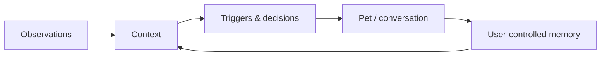

<p align="center">
  
</p>

<h1 align="center">Amadeus · Personal Desktop Agent</h1>

<p align="center">
  A local-first, proactive desktop companion with user-controlled memory for Windows and macOS
</p>

<p align="center"><a href="README.md">中文</a></p>

---

## What it is

Amadeus is an independent personal desktop agent. The pet is its interaction surface, built-in activity awareness is one observation capability, and local SQLite is its user-controlled memory layer. Existing TimeTrace databases remain a migration source, not a runtime dependency.



This separation matters:

- An observation is ephemeral context, not automatically a permanent memory.
- A Live2D avatar is visual presentation, not the agent's personality.
- Activity awareness can be paused or disabled without breaking chat or local memory.
- Future calendar, GitHub, or system integrations can be added as capabilities instead of rewriting the agent.

## Highlights

- OpenAI, DeepSeek, and custom OpenAI-compatible endpoints
- Streaming chat with incomplete-response protection
- Configurable proactive triggers, rate limits, adaptive quiet mode, and idle sleep
- Built-in Windows/macOS frontmost-app and idle awareness with a local timeline
- Tray pause, app exclusions, configurable 1–168 hour retention, and range clearing
- Local SQLite memory and privacy-filtered activity summaries
- Local Cubism 2.1 model import with dependency validation
- WebView2 on Windows and WKWebView on macOS
- Cross-platform tray, transparent pet window, and a dedicated settings window
- Rights-aware onboarding and a cohesive desktop settings experience

## Privacy and rights

Amadeus never bundles or downloads third-party character models or personas. The public build ships with an original Amadeus persona. Users must confirm that they have the right to use imported assets; local personal use does not automatically grant redistribution or commercial rights.

Amadeus does not collect screenshots, audio, window titles, file paths, browser history, or typed content. Frontmost-app and idle events remain in a separate local database for 48 hours by default. Online requests contain the user's message, necessary conversation context, and — only when relevant and enabled — a compact, privacy-filtered activity aggregate.

Windows keeps the legacy `%APPDATA%\timepet` directory. macOS uses `~/Library/Application Support/Amadeus`.

## Build

Use Flutter stable. Windows requires Visual Studio Desktop C++; macOS requires Xcode.

```bash
flutter pub get
flutter analyze
flutter test

flutter build windows --release
flutter build macos --release
```

GitHub Actions validates analysis/tests and builds on native Windows and macOS runners. The macOS CI artifact is not notarized; public distribution still requires Developer ID signing and Apple notarization to avoid Gatekeeper warnings.

## Architecture

| Module | Responsibility |
| --- | --- |
| `observation_source.dart` | Agent capability boundary |
| `activity_history.dart` | Built-in activity capture, short-lived SQLite timeline, and deletion policy |
| `tt_api.dart` | Activity aggregation and legacy TimeTrace compatibility |
| `pet_memory.dart` | Memory selection, retrieval, and profile synthesis |
| `trigger_engine.dart` | Initiative and interruption control |
| `lib/ui/` | Onboarding, settings, chat bubble, and input |
| `assets/web/` | Cross-platform Live2D web renderer |

## Activity-awareness boundary

The control model is inspired by Computer History: visible state, tray pause, source exclusions, short-lived raw events, and a clearable timeline. The implementation intentionally stays narrow. Every 10 seconds it asks the native layer only for the frontmost application identity and global idle duration; it does not request screen-recording or accessibility content.

Windows uses the foreground Win32 process and `GetLastInputInfo`. macOS uses `NSWorkspace.frontmostApplication` and `CGEventSource` idle time. Both store minimal events in the local `activity.db` before deriving aggregate conversational context.

## License

[GPL-3.0](LICENSE). `assets/web/vendor/live2d-widget` is based on `stevenjoezhang/live2d-widget` (AGPL-3.0); see its bundled license.
